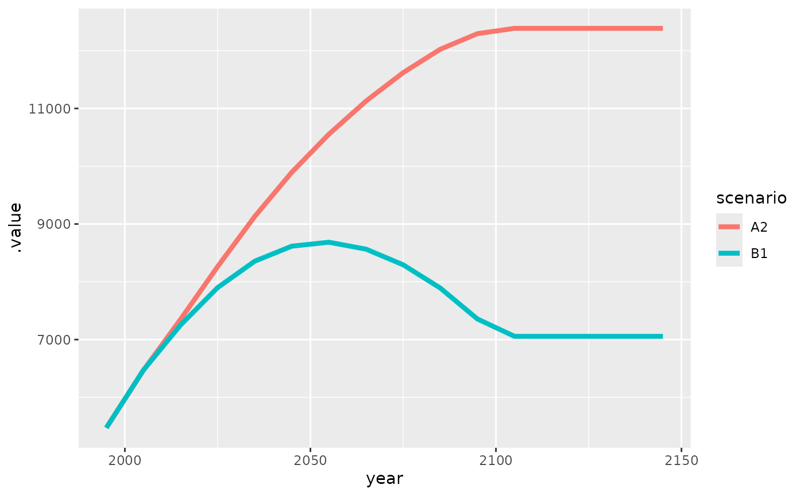

# MAGPIE Class Tutorial

This tutorial provides a basic introduction to magpie objects in R. If
you would like to get more details on the concept of and the idea behind
magpie objects you can have a look at
[magclass-concept](magclass-concept.md), where this is explained in more
detail by comparing the magpie class to other data classes in R.

## Generate a magpie object

Generation of magpie objects can either be done from scratch, by reading
in files or by converting objects from other classes to magpie objects.
For creation of a new magpie object you can use `new.magpie`, conversion
of an existing object happens with `as.magpie`:

``` r
library(magclass)
#> 
#> Attaching package: 'magclass'
#> The following objects are masked from 'package:base':
#> 
#>     pmax, pmin

# creating a magpie object with 2 regions, 2 years and 2 different values
m <- new.magpie(cells_and_regions = c("AFR", "CPA"),
                years = c(1995, 2000),
                names = c("bla", "blub"),
                sets = c("region", "year", "value"),
                fill = 0)
print(m)
#> , , value = bla
#> 
#>       year
#> region y1995 y2000
#>    AFR     0     0
#>    CPA     0     0
#> 
#> , , value = blub
#> 
#>       year
#> region y1995 y2000
#>    AFR     0     0
#>    CPA     0     0

# converting a simple vector with one value per region to a magpie object
v <- c(ENG = 10, USA = 20, BRA = 30, CHN = 40, IND = 50)
m2 <- as.magpie(v)
str(m2)
#> A magpie object (package: magclass)
#>  @ .Data:  num [1:5] 10 20 30 40 50
#>  $ dimnames:List of 3
#>   ..$ fake: chr [1:5] "ENG" "USA" "BRA" "CHN" ...
#>   ..$ NA  : NULL
#>   ..$ NA  : NULL
```

In the example above the names were automatically detected as regions,
if for some reason the automatic detection fails you can also indicate
to what type of dimension the data belongs. Lets assume in the following
example, that the names are not representing regions but something else.
The argument `spatial=0` indicates the non-existence of a spatial
dimension, but it can also be used to point to the spatial dimension in
the data.

``` r
m3 <- as.magpie(v, spatial = 0)
str(m3)
#> A magpie object (package: magclass)
#>  @ .Data:  num [1:5] 10 20 30 40 50
#>  $ dimnames:List of 3
#>   ..$ fake: chr "GLO"
#>   ..$ NA  : NULL
#>   ..$ NA  : chr [1:5] "ENG" "USA" "BRA" "CHN" ...
```

## Accessing magpie objects

For the following a example data set containing population data is used.

``` r
pm <- maxample("pop")
```

### General properties

Let’s first have a look at the content of the magpie object:

Show the structure of the object:

``` r
str(pm)
#> A magpie object (package: magclass)
#>  @ .Data:  num [1:320] 553 1281 554 276 452 ...
#>  $ dimnames:List of 3
#>   ..$ i       : chr [1:10] "AFR" "CPA" "EUR" "FSU" ...
#>   ..$ t       : chr [1:16] "y1995" "y2005" "y2015" "y2025" ...
#>   ..$ scenario: chr [1:2] "A2" "B1"
#>  $ Metadata:List of 3
#>   ..$ unit: 'units' num 1e+06
#>   .. ..- attr(*, "units")=List of 2
#>   .. .. ..$ numerator  : chr "people"
#>   .. .. ..$ denominator: chr(0) 
#>   .. .. ..- attr(*, "class")= chr "symbolic_units"
#>   ..$ user: chr "jpd"
#>   ..$ date: chr "2018-01-15 14:19:27"
```

Show the first elements:

``` r
head(pm)
#> An object of class "magpie"
#> , , scenario = A2
#> 
#>      t
#> i         y1995   y2005   y2015   y2025   y2035   y2045
#>   AFR  552.6664  696.44  889.18 1124.11 1389.33 1659.73
#>   CPA 1280.6350 1429.53 1518.46 1592.09 1640.95 1671.94
#>   EUR  554.4384  582.36  593.76  605.27  614.58  618.97
#> 
#> , , scenario = B1
#> 
#>      t
#> i         y1995   y2005   y2015   y2025   y2035   y2045
#>   AFR  552.6664  721.85  932.04 1118.33 1267.33 1383.24
#>   CPA 1280.6350 1429.26 1499.74 1531.12 1518.73 1463.68
#>   EUR  554.4384  587.21  603.63  613.98  619.48  617.12
```

Show the last elements:

``` r
tail(pm)
#> An object of class "magpie"
#> , , scenario = A2
#> 
#>      t
#> i       y2095   y2105   y2115   y2125   y2135   y2145
#>   PAO  166.31  167.49  167.49  167.49  167.49  167.49
#>   PAS  843.52  839.53  839.53  839.53  839.53  839.53
#>   SAS 3007.86 2972.39 2972.39 2972.39 2972.39 2972.39
#> 
#> , , scenario = B1
#> 
#>      t
#> i       y2095   y2105   y2115   y2125   y2135   y2145
#>   PAO  140.82  138.80  138.80  138.80  138.80  138.80
#>   PAS  536.24  507.06  507.06  507.06  507.06  507.06
#>   SAS 1629.07 1528.15 1528.15 1528.15 1528.15 1528.15
```

Which elements are there?

``` r
getItems(pm)
#> $i
#>  [1] "AFR" "CPA" "EUR" "FSU" "LAM" "MEA" "NAM" "PAO" "PAS" "SAS"
#> 
#> $t
#>  [1] "y1995" "y2005" "y2015" "y2025" "y2035" "y2045" "y2055" "y2065"
#>  [9] "y2075" "y2085" "y2095" "y2105" "y2115" "y2125" "y2135" "y2145"
#> 
#> $scenario
#> [1] "A2" "B1"
```

Which spatial elements are there?

``` r
getItems(pm, dim = 1)
#>  [1] "AFR" "CPA" "EUR" "FSU" "LAM" "MEA" "NAM" "PAO" "PAS" "SAS"
```

Which scenarios?

``` r
getItems(pm, dim = 3)
#> [1] "A2" "B1"
```

`getItems` as well as most of the other functions allow to select a
dimension either via its dimension code (as done in the previous
example), or via its dimension name:

``` r
getItems(pm, dim = "scenario")
#> [1] "A2" "B1"
```

In terms of readability it is recommended to use the dimension name
where possible, but one has to keep in mind that sometimes the dimension
name might not be well defined and vary from case to case. In these
instances it is safer to use the dimension code.

What are the sets (dimensions names) of the data?

``` r
getSets(pm)
#>       d1.1       d2.1       d3.1 
#>        "i"        "t" "scenario"
```

are there any comments which come with the data?

``` r
getComment(pm)
#> NULL
```

let’s have a look at a higher dimensional object

``` r
a <- maxample("animal")
```

what is the full dimensionality of this object?

``` r
getItems(a)
#> $x.y.country.cell
#>  [1] "5p75.53p25.NLD.14084" "6p25.53p25.NLD.14113"
#>  [3] "6p75.53p25.NLD.14141" "4p75.52p75.NLD.14040"
#>  [5] "5p75.52p75.NLD.14083" "6p25.52p75.NLD.14112"
#>  [7] "6p75.52p75.NLD.14140" "4p75.52p25.NLD.14039"
#>  [9] "5p25.52p25.NLD.14058" "5p75.52p25.NLD.14082"
#> [11] "6p25.52p25.NLD.14111" "6p75.52p25.NLD.14139"
#> [13] "4p25.51p75.NLD.14021" "4p75.51p75.NLD.14038"
#> [15] "5p25.51p75.NLD.14057" "5p75.51p75.NLD.14081"
#> [17] "3p25.51p25.BEL.13988" "3p75.51p25.BEL.14004"
#> [19] "4p25.51p25.BEL.14020" "4p75.51p25.BEL.14037"
#> [21] "5p25.51p25.BEL.14056" "5p75.51p25.NLD.14080"
#> [23] "3p25.50p75.BEL.13987" "3p75.50p75.BEL.14003"
#> [25] "4p25.50p75.BEL.14019" "4p75.50p75.BEL.14036"
#> [27] "5p25.50p75.BEL.14055" "5p75.50p75.BEL.14079"
#> [29] "4p25.50p25.BEL.14018" "4p75.50p25.BEL.14035"
#> [31] "5p25.50p25.BEL.14054" "5p75.50p25.BEL.14078"
#> [33] "5p25.49p75.BEL.14053" "5p75.49p75.BEL.14077"
#> [35] "6p25.49p75.LUX.14106"
#> 
#> $year.month.day
#>  [1] "y2000.april.20"  "y2000.may.20"    "y2000.june.20"  
#>  [4] "y2001.april.20"  "y2001.may.20"    "y2001.june.20"  
#>  [7] "y2002.april.20"  "y2002.may.20"    "y2002.june.20"  
#> [10] "y2002.august.20"
#> 
#> $type.species.color
#> [1] "animal.rabbit.black" "animal.rabbit.white" "animal.bird.black"  
#> [4] "animal.bird.red"     "animal.dog.brown"
```

…split in sub-dimensions

``` r
getItems(a, split = TRUE)
#> [[1]]
#> [[1]]$x
#> [1] "5p75" "6p25" "6p75" "4p75" "5p25" "4p25" "3p25" "3p75"
#> 
#> [[1]]$y
#> [1] "53p25" "52p75" "52p25" "51p75" "51p25" "50p75" "50p25" "49p75"
#> 
#> [[1]]$country
#> [1] "NLD" "BEL" "LUX"
#> 
#> [[1]]$cell
#>  [1] "14084" "14113" "14141" "14040" "14083" "14112" "14140" "14039"
#>  [9] "14058" "14082" "14111" "14139" "14021" "14038" "14057" "14081"
#> [17] "13988" "14004" "14020" "14037" "14056" "14080" "13987" "14003"
#> [25] "14019" "14036" "14055" "14079" "14018" "14035" "14054" "14078"
#> [33] "14053" "14077" "14106"
#> 
#> 
#> [[2]]
#> [[2]]$year
#> [1] "y2000" "y2001" "y2002"
#> 
#> [[2]]$month
#> [1] "april"  "may"    "june"   "august"
#> 
#> [[2]]$day
#> [1] "20"
#> 
#> 
#> [[3]]
#> [[3]]$type
#> [1] "animal"
#> 
#> [[3]]$species
#> [1] "rabbit" "bird"   "dog"   
#> 
#> [[3]]$color
#> [1] "black" "white" "red"   "brown"
```

These functions can also be used to manipulate the object:

set a comment

``` r
getComment(pm) <- "This is a comment!"
getComment(pm)
#> [1] "This is a comment!"
```

…or alternatively

``` r
pm2 <- setComment(pm, "This is comment for pm2!")
getComment(pm2)
#> [1] "This is comment for pm2!"
```

rename 1st region in “RRR”

``` r
getItems(pm, dim = 1)[1] <- "RRR"
```

rename region set in “zones”

``` r
getSets(pm)[2] <- "year"
```

Finally, to get a quick impression of the content of the object, you can
get a rough plot:

``` r
mplot(pm)
```



### Subsets

Now that we have had a look into the structure of the object let’s
extract some subsets out of it. There are different methods that can be
used to extract data from a magpie object. Here are some examples:

Return all A2 related data for LAM and the years 2005 and 2015

``` r
pm["LAM", c(2005, 2015), "A2"]
#> An object of class "magpie"
#> , , scenario = A2
#> 
#>      year
#> i      y2005  y2015
#>   LAM 558.29 646.02
```

Return data for regions which have “AS” in its name (pmatch allows for
partial matching of the given search string)

``` r
pm["AS", , , pmatch = TRUE]
#> An object of class "magpie"
#> , , scenario = A2
#> 
#>      year
#> i         y1995   y2005   y2015   y2025   y2035   y2045   y2055
#>   PAS  383.2277  534.73  604.94  668.49  723.13  767.30  798.68
#>   SAS 1269.9243 1505.02 1796.76 2095.48 2369.60 2600.68 2783.75
#>      year
#> i       y2065   y2075   y2085   y2095   y2105   y2115   y2125   y2135
#>   PAS  819.21  834.31  844.38  843.52  839.53  839.53  839.53  839.53
#>   SAS 2920.70 3006.60 3040.10 3007.86 2972.39 2972.39 2972.39 2972.39
#>      year
#> i       y2145
#>   PAS  839.53
#>   SAS 2972.39
#> 
#> , , scenario = B1
#> 
#>      year
#> i         y1995   y2005   y2015   y2025   y2035   y2045   y2055
#>   PAS  383.2277  530.67  590.42  639.68  674.98  692.45  689.79
#>   SAS 1269.9243 1475.64 1687.80 1870.96 1999.15 2072.68 2090.96
#>      year
#> i       y2065   y2075   y2085   y2095   y2105   y2115   y2125   y2135
#>   PAS  668.98  634.64  590.05  536.24  507.06  507.06  507.06  507.06
#>   SAS 2049.18 1953.77 1811.83 1629.07 1528.15 1528.15 1528.15 1528.15
#>      year
#> i       y2145
#>   PAS  507.06
#>   SAS 1528.15
```

If you want to specifically select from one dimension from which you
have the dimension name:

``` r
mselect(pm, scenario = "B1", i = c("FSU", "LAM"))
#> An object of class "magpie"
#> , , scenario = B1
#> 
#>      year
#> i        y1995  y2005  y2015  y2025  y2035  y2045  y2055  y2065  y2075
#>   FSU 276.3431 296.84 305.26 309.78 311.47 309.03 301.99 292.46 281.39
#>   LAM 451.9981 552.79 623.20 681.60 723.44 747.70 753.98 743.05 718.79
#>      year
#> i      y2085  y2095  y2105  y2115  y2125  y2135  y2145
#>   FSU 269.77 257.52 251.04 251.04 251.04 251.04 251.04
#>   LAM 683.68 637.69 611.88 611.88 611.88 611.88 611.88
```

Or you can use alternatively:

``` r
pm[list(i = c("FSU", "LAM")), , list(scenario = "B1")]
#> An object of class "magpie"
#> , , scenario = B1
#> 
#>      year
#> i        y1995  y2005  y2015  y2025  y2035  y2045  y2055  y2065  y2075
#>   FSU 276.3431 296.84 305.26 309.78 311.47 309.03 301.99 292.46 281.39
#>   LAM 451.9981 552.79 623.20 681.60 723.44 747.70 753.98 743.05 718.79
#>      year
#> i      y2085  y2095  y2105  y2115  y2125  y2135  y2145
#>   FSU 269.77 257.52 251.04 251.04 251.04 251.04 251.04
#>   LAM 683.68 637.69 611.88 611.88 611.88 611.88 611.88
```

### Data transformations / calculations

Now we can perform some calculations with it.

take a subset of the data as an example

``` r
d <- head(pm)
```

create a new object with some fancy calculations

``` r
d2 <- d^2 + 12 * d + 99 / exp(d)
getItems(d2, dim = 3) <- c("NEWSCEN1", "NEWSCEN2")
getSets(d2)[3] <- "newscen"
d2
#> An object of class "magpie"
#> , , newscen = NEWSCEN1
#> 
#>      year
#> i         y1995     y2005     y2015   y2025     y2035     y2045
#>   RRR  312072.1  493386.0  801311.2 1277113 1946909.7 2774620.4
#>   CPA 1655393.6 2060710.5 2323942.2 2553856 2712408.1 2815446.4
#>   EUR  314055.2  346131.5  359676.1  373615  385083.6  390551.5
#> 
#> , , newscen = NEWSCEN2
#> 
#>      year
#> i         y1995     y2005     y2015     y2025     y2035     y2045
#>   RRR  312072.1  529729.6  879883.0 1264081.9 1621333.2 1929951.8
#>   CPA 1655393.6 2059935.3 2267216.9 2362701.9 2324765.5 2159923.5
#>   EUR  314055.2  351862.1  371612.7  384339.2  391189.2  388242.5
```

multiply both data sets with each other

``` r
d <- d * d2
d
#> An object of class "magpie"
#> , , scenario.newscen = A2.NEWSCEN1
#> 
#>      year
#> i          y1995      y2005      y2015      y2025      y2035
#>   RRR  172471773  343613717  712509904 1435615002 2704899949
#>   CPA 2119955061 2945847491 3528813140 4065967778 4450926008
#>   EUR  174124277  201573119  213561266  226137981  236664659
#>      year
#> i          y2045
#>   RRR 4605120609
#>   CPA 4707257368
#>   EUR  241739628
#> 
#> , , scenario.newscen = A2.NEWSCEN2
#> 
#>      year
#> i          y1995      y2005      y2015      y2025      y2035
#>   RRR  172471773  368924875  782374360 1420967030 2252566752
#>   CPA 2119955061 2944739364 3442678113 3761633954 3814823856
#>   EUR  174124277  204910425  220648786  232628981  240417069
#>      year
#> i          y2045
#>   RRR 3203198781
#>   CPA 3611262304
#>   EUR  240310466
#> 
#> , , scenario.newscen = B1.NEWSCEN1
#> 
#>      year
#> i          y1995      y2005      y2015      y2025      y2035
#>   RRR  172471773  356150641  746854091 1428233254 2467376967
#>   CPA 2119955061 2945291059 3485309011 3910259280 4119415564
#>   EUR  174124277  203251869  217111267  229392153  238551555
#>      year
#> i          y2045
#>   RRR 3837965851
#>   CPA 4120912807
#>   EUR  241017118
#> 
#> , , scenario.newscen = B1.NEWSCEN2
#> 
#>      year
#> i          y1995      y2005      y2015      y2025      y2035
#>   RRR  172471773  382385289  820086132 1413660600 2054764104
#>   CPA 2119955061 2944183141 3400235879 3617580090 3530691083
#>   EUR  174124277  206616969  224316602  235976560  242333882
#>      year
#> i          y2045
#>   RRR 2669586440
#>   CPA 3161436886
#>   EUR  239592227
```

Because we changed the names of the elements in the data dimension it is
assumed that they reflect different dimensions. Therefor the object is
blown up in size instead of just having the elements multiplied pairwise
with each other as it happens when two objects with identical
dimensionality are multiplied with each other:

``` r
d2 * d2
#> An object of class "magpie"
#> , , newscen = NEWSCEN1
#> 
#>      year
#> i            y1995        y2005        y2015        y2025        y2035
#>   RRR 9.738901e+10 2.434297e+11 6.420997e+11 1.631017e+12 3.790457e+12
#>   CPA 2.740328e+12 4.246528e+12 5.400707e+12 6.522178e+12 7.357158e+12
#>   EUR 9.863068e+10 1.198070e+11 1.293669e+11 1.395882e+11 1.482893e+11
#>      year
#> i            y2045
#>   RRR 7.698518e+12
#>   CPA 7.926739e+12
#>   EUR 1.525304e+11
#> 
#> , , newscen = NEWSCEN2
#> 
#>      year
#> i            y1995        y2005        y2015        y2025        y2035
#>   RRR 9.738901e+10 2.806134e+11 7.741941e+11 1.597903e+12 2.628721e+12
#>   CPA 2.740328e+12 4.243333e+12 5.140273e+12 5.582360e+12 5.404535e+12
#>   EUR 9.863068e+10 1.238070e+11 1.380960e+11 1.477166e+11 1.530290e+11
#>      year
#> i            y2045
#>   RRR 3.724714e+12
#>   CPA 4.665269e+12
#>   EUR 1.507323e+11
```

sum over the data dimension

``` r
dimSums(d, dim = 3)
#> An object of class "magpie"
#> , , 1
#> 
#>      year
#> i          y1995       y2005       y2015       y2025       y2035
#>   RRR  689887091  1451074522  3061824487  5698475887  9479607771
#>   CPA 8479820244 11780061055 13857036143 15355441102 15915856510
#>   EUR  696497109   816352383   875637922   924135674   957967165
#>      year
#> i           y2045
#>   RRR 14315871681
#>   CPA 15600869364
#>   EUR   962659440
```

..over the second data dimension only

``` r
dimSums(d, dim = 3.2)
#> An object of class "magpie"
#> , , scenario = A2
#> 
#>      year
#> i          y1995      y2005      y2015      y2025      y2035
#>   RRR  344943546  712538592 1494884264 2856582032 4957466700
#>   CPA 4239910122 5890586855 6971491254 7827601732 8265749863
#>   EUR  348248554  406483544  434210052  458766961  477081728
#>      year
#> i          y2045
#>   RRR 7808319390
#>   CPA 8318519671
#>   EUR  482050095
#> 
#> , , scenario = B1
#> 
#>      year
#> i          y1995      y2005      y2015      y2025      y2035
#>   RRR  344943546  738535930 1566940224 2841893854 4522141071
#>   CPA 4239910122 5889474200 6885544890 7527839370 7650106647
#>   EUR  348248554  409868839  441427869  465368713  480885436
#>      year
#> i          y2045
#>   RRR 6507552291
#>   CPA 7282349693
#>   EUR  480609345
```

..or alternatively addressed by name

``` r
dimSums(d, dim = "newscen")
#> An object of class "magpie"
#> , , scenario = A2
#> 
#>      year
#> i          y1995      y2005      y2015      y2025      y2035
#>   RRR  344943546  712538592 1494884264 2856582032 4957466700
#>   CPA 4239910122 5890586855 6971491254 7827601732 8265749863
#>   EUR  348248554  406483544  434210052  458766961  477081728
#>      year
#> i          y2045
#>   RRR 7808319390
#>   CPA 8318519671
#>   EUR  482050095
#> 
#> , , scenario = B1
#> 
#>      year
#> i          y1995      y2005      y2015      y2025      y2035
#>   RRR  344943546  738535930 1566940224 2841893854 4522141071
#>   CPA 4239910122 5889474200 6885544890 7527839370 7650106647
#>   EUR  348248554  409868839  441427869  465368713  480885436
#>      year
#> i          y2045
#>   RRR 6507552291
#>   CPA 7282349693
#>   EUR  480609345
```

sum over regions and first data dimension

``` r
dimSums(d, dim = c(1, 3.1))
#> An object of class "magpie"
#> , , newscen = NEWSCEN1
#> 
#>       year
#> d1          y1995      y2005      y2015       y2025       y2035
#>   [1,] 4933102222 6995727898 8904158681 11295605448 14217834702
#>       year
#> d1           y2045
#>   [1,] 17754013380
#> 
#> , , newscen = NEWSCEN2
#> 
#>       year
#> d1          y1995      y2005      y2015       y2025       y2035
#>   [1,] 4933102222 7051760063 8890339872 10682447215 12135596744
#>       year
#> d1           y2045
#>   [1,] 13125387105
```

apply a lowpass filter on the data

``` r
lowpass(d)
#> An object of class "magpie"
#> , , scenario.newscen = A2.NEWSCEN1
#> 
#>      year
#> i          y1995      y2005      y2015      y2025      y2035
#>   RRR  215257259  393052278  801062132 1572159964 2862633877
#>   CPA 2326428169 2885115796 3517360387 4027918676 4418769290
#>   EUR  180986488  197707946  213708408  225625472  235301732
#>      year
#> i          y2045
#>   RRR 4130065444
#>   CPA 4643174528
#>   EUR  240470886
#> 
#> , , scenario.newscen = A2.NEWSCEN2
#> 
#>      year
#> i          y1995      y2005      y2015      y2025      y2035
#>   RRR  221585048  423173971  838660156 1469218793 2282324829
#>   CPA 2326151137 2863027975 3397932386 3695192469 3750635992
#>   EUR  181820814  201148478  219709244  231580954  238443396
#>      year
#> i          y2045
#>   RRR 2965540774
#>   CPA 3662152692
#>   EUR  240337117
#> 
#> , , scenario.newscen = B1.NEWSCEN1
#> 
#>      year
#> i          y1995      y2005      y2015      y2025      y2035
#>   RRR  218391490  407906787  819523019 1517674392 2550238260
#>   CPA 2326289061 2873961548 3456542090 3856310784 4067500804
#>   EUR  181406175  199434821  216716639  228611782  236878095
#>      year
#> i          y2045
#>   RRR 3495318630
#>   CPA 4120538496
#>   EUR  240400727
#> 
#> , , scenario.newscen = B1.NEWSCEN2
#> 
#>      year
#> i          y1995      y2005      y2015      y2025      y2035
#>   RRR  224950152  439332121  859054538 1425542859 2048193812
#>   CPA 2326012081 2852139305 3340558747 3541521785 3460099785
#>   EUR  182247450  202918704  222806683  234650901  240059138
#>      year
#> i          y2045
#>   RRR 2515880856
#>   CPA 3253750435
#>   EUR  240277641
```

do a linear interpolation of the data over time (yearly)

``` r
time_interpolate(d[, , 1], 2005:2030)
#> An object of class "magpie"
#> , , scenario.newscen = A2.NEWSCEN1
#> 
#>      year
#> i          y2005      y2006      y2007      y2008      y2009
#>   RRR  343613717  380503336  417392955  454282573  491172192
#>   CPA 2945847491 3004144056 3062440621 3120737186 3179033751
#>   EUR  201573119  202771934  203970749  205169563  206368378
#>      year
#> i          y2010      y2011      y2012      y2013      y2014
#>   RRR  528061811  564951429  601841048  638730667  675620285
#>   CPA 3237330316 3295626881 3353923446 3412220011 3470516576
#>   EUR  207567193  208766008  209964822  211163637  212362452
#>      year
#> i          y2015      y2016      y2017      y2018      y2019
#>   RRR  712509904  784820414  857130924  929441434 1001751943
#>   CPA 3528813140 3582528604 3636244068 3689959532 3743674995
#>   EUR  213561266  214818938  216076609  217334281  218591952
#>      year
#> i          y2020      y2021      y2022      y2023      y2024
#>   RRR 1074062453 1146372963 1218683473 1290993983 1363304493
#>   CPA 3797390459 3851105923 3904821386 3958536850 4012252314
#>   EUR  219849624  221107295  222364966  223622638  224880309
#>      year
#> i          y2025      y2026      y2027      y2028      y2029
#>   RRR 1435615002 1562543497 1689471992 1816400486 1943328981
#>   CPA 4065967778 4104463601 4142959424 4181455247 4219951070
#>   EUR  226137981  227190648  228243316  229295984  230348652
#>      year
#> i          y2030
#>   RRR 2070257476
#>   CPA 4258446893
#>   EUR  231401320
```

split the data, do some calculations and bind it back together

``` r
d1 <- d[, 1:3, ] * 100
d2 <- d[, 4:6, ] * (-1)
dd <- mbind(d1, d2)
dd
#> An object of class "magpie"
#> , , scenario.newscen = A2.NEWSCEN1
#> 
#>      year
#> i            y1995        y2005        y2015       y2025       y2035
#>   RRR  17247177286  34361371712  71250990410 -1435615002 -2704899949
#>   CPA 211995506103 294584749142 352881314048 -4065967778 -4450926008
#>   EUR  17412427723  20157311917  21356126643  -226137981  -236664659
#>      year
#> i           y2045
#>   RRR -4605120609
#>   CPA -4707257368
#>   EUR  -241739628
#> 
#> , , scenario.newscen = A2.NEWSCEN2
#> 
#>      year
#> i            y1995        y2005        y2015       y2025       y2035
#>   RRR  17247177286  36892487484  78237435983 -1420967030 -2252566752
#>   CPA 211995506103 294473936352 344267811303 -3761633954 -3814823856
#>   EUR  17412427723  20491042497  22064878583  -232628981  -240417069
#>      year
#> i           y2045
#>   RRR -3203198781
#>   CPA -3611262304
#>   EUR  -240310466
#> 
#> , , scenario.newscen = B1.NEWSCEN1
#> 
#>      year
#> i            y1995        y2005        y2015       y2025       y2035
#>   RRR  17247177286  35615064104  74685409122 -1428233254 -2467376967
#>   CPA 211995506103 294529105935 348530901109 -3910259280 -4119415564
#>   EUR  17412427723  20325186949  21711126748  -229392153  -238551555
#>      year
#> i           y2045
#>   RRR -3837965851
#>   CPA -4120912807
#>   EUR  -241017118
#> 
#> , , scenario.newscen = B1.NEWSCEN2
#> 
#>      year
#> i            y1995        y2005        y2015       y2025       y2035
#>   RRR  17247177286  38238528941  82008613234 -1413660600 -2054764104
#>   CPA 211995506103 294418314075 340023587875 -3617580090 -3530691083
#>   EUR  17412427723  20661696919  22431660178  -235976560  -242333882
#>      year
#> i           y2045
#>   RRR -2669586440
#>   CPA -3161436886
#>   EUR  -239592227
```

set all values greater than 0.5 to 0.51

``` r
d[d > 0.5] <- 0.51
d
#> An object of class "magpie"
#> , , scenario.newscen = A2.NEWSCEN1
#> 
#>      year
#> i     y1995 y2005 y2015 y2025 y2035 y2045
#>   RRR  0.51  0.51  0.51  0.51  0.51  0.51
#>   CPA  0.51  0.51  0.51  0.51  0.51  0.51
#>   EUR  0.51  0.51  0.51  0.51  0.51  0.51
#> 
#> , , scenario.newscen = A2.NEWSCEN2
#> 
#>      year
#> i     y1995 y2005 y2015 y2025 y2035 y2045
#>   RRR  0.51  0.51  0.51  0.51  0.51  0.51
#>   CPA  0.51  0.51  0.51  0.51  0.51  0.51
#>   EUR  0.51  0.51  0.51  0.51  0.51  0.51
#> 
#> , , scenario.newscen = B1.NEWSCEN1
#> 
#>      year
#> i     y1995 y2005 y2015 y2025 y2035 y2045
#>   RRR  0.51  0.51  0.51  0.51  0.51  0.51
#>   CPA  0.51  0.51  0.51  0.51  0.51  0.51
#>   EUR  0.51  0.51  0.51  0.51  0.51  0.51
#> 
#> , , scenario.newscen = B1.NEWSCEN2
#> 
#>      year
#> i     y1995 y2005 y2015 y2025 y2035 y2045
#>   RRR  0.51  0.51  0.51  0.51  0.51  0.51
#>   CPA  0.51  0.51  0.51  0.51  0.51  0.51
#>   EUR  0.51  0.51  0.51  0.51  0.51  0.51
```

round the data

``` r
round(d, 0)
#> An object of class "magpie"
#> , , scenario.newscen = A2.NEWSCEN1
#> 
#>      year
#> i     y1995 y2005 y2015 y2025 y2035 y2045
#>   RRR     1     1     1     1     1     1
#>   CPA     1     1     1     1     1     1
#>   EUR     1     1     1     1     1     1
#> 
#> , , scenario.newscen = A2.NEWSCEN2
#> 
#>      year
#> i     y1995 y2005 y2015 y2025 y2035 y2045
#>   RRR     1     1     1     1     1     1
#>   CPA     1     1     1     1     1     1
#>   EUR     1     1     1     1     1     1
#> 
#> , , scenario.newscen = B1.NEWSCEN1
#> 
#>      year
#> i     y1995 y2005 y2015 y2025 y2035 y2045
#>   RRR     1     1     1     1     1     1
#>   CPA     1     1     1     1     1     1
#>   EUR     1     1     1     1     1     1
#> 
#> , , scenario.newscen = B1.NEWSCEN2
#> 
#>      year
#> i     y1995 y2005 y2015 y2025 y2035 y2045
#>   RRR     1     1     1     1     1     1
#>   CPA     1     1     1     1     1     1
#>   EUR     1     1     1     1     1     1
```
